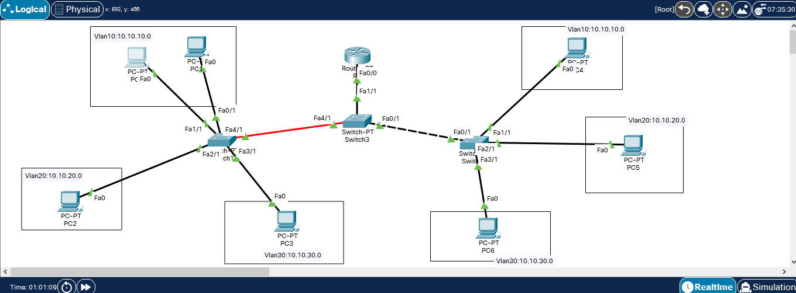

# Vlan configurtion


for each switch:
```
Switch>enable
Switch#configure terminal
```

# switch 1 configuration 

## adding vlans
```
Switch1(config)#vlan 10
Switch1(config-vlan)#name vlan10
Switch1(config-vlan)#exit

Switch1(config)#vlan 20
Switch1(config-vlan)#name vlan20
Switch1(config-vlan)#exit

Switch1(config)#vlan 30
Switch1(config-vlan)#name vlan30
```
## assigning each interface to its vlan

```
Switch1(config)#interface fa0/1
Switch1(config-if)#switch port mode access
Switch1(config-if)#switch access vlan 10

Switch1(config)#interface fa1/1
Switch1(config-if)#switch port mode access
Switch1(config-if)#switch access vlan 10

Switch1(config)#interface fa2/1
Switch1(config-if)#switch port mode access
Switch1(config-if)#switch access vlan 20

Switch1(config)#interface fa3/1
Switch1(config-if)#switch port mode access
Switch1(config-if)#switch access vlan 30
```

## configure interface that doesn't belong to any vlan to mode trunk
```
Switch1(config)#interface fa4/1
Switch1(config-if)#switch port mode trunk
```

# switch 2 configuration 

same as switch 1 steps are:
- adding vlans
- assign each interface to its vlan
- configure interface that doesn't belong to any vlan to mode trunk


# switch 3 configuration 

## adding vlans
```
Switch3(config)#vlan 10
Switch3(config-vlan)#name vlan10
Switch3(config-vlan)#exit

Switch3(config)#vlan 20
Switch3(config-vlan)#name vlan20
Switch3(config-vlan)#exit

Switch3(config)#vlan 30
Switch3(config-vlan)#name vlan30
```

## configure swtich 3 interfaces to mode trunk

```
Switch3(config)#interface fa4/1
Switch3(config-if)#switch port mode trunk

Switch3(config)#interface fa0/1
Switch3(config-if)#switch port mode trunk
```

# Routing between vlans

## configure swtich 3 interface linked to router to mode trunk
```
Switch3(config)#interface fa1/1
Switch3(config-if)#switch port mode trunk
```
## dynamic routing using dot1q

```
router(config)#interface fa0/0.10
router(config-subif)#encapsulation dot1q 10
router(config-subif)#ip address 10.10.10.1 255.255.255.0
router(config-subif)#exit

router(config)#interface fa0/0.20
router(config-subif)#encapsulation dot1q 20
router(config-subif)#ip address 10.10.20.1 255.255.255.0
router(config-subif)#exit

router(config)#interface fa0/0.30
router(config-subif)#encapsulation dot1q 30
router(config-subif)#ip address 10.10.30.1 255.255.255.0
router(config-subif)#exit

router(config)#interface fa0/0
router(config-if)#no shutdown
```

# Note

- dont forget to configure ip address of each pc in the vlan
- dont forget to specify the default gateway for each vlan
    - vlan 10 :10.10.10.1
    - vlan 20 :10.10.20.1
    - vlan 30 :10.10.20.1


